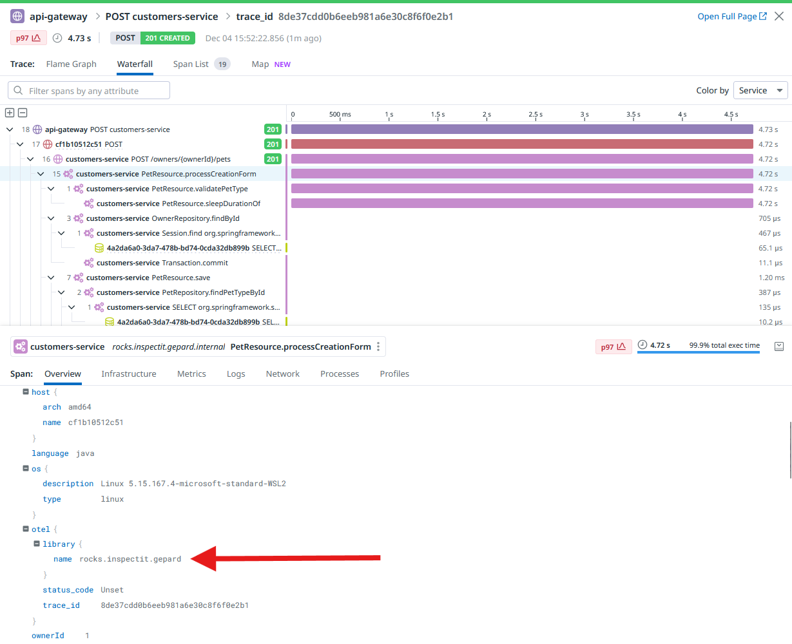

# Gepard meets Datadog

This demo collects data via **inspectIT Gepard**, which exports the data via OpenTelemetry Collector to Datadog.
To run this demo, follow these steps:

- Install docker on your system
- Create a Datadog API key ([start a free trial here](https://www.datadoghq.com/free-datadog-trial/))
- Put your API key into the `.env` file
- Start the demo via `docker compose up -d`

There is already a configuration to collect traces. You should see some traces like this:

